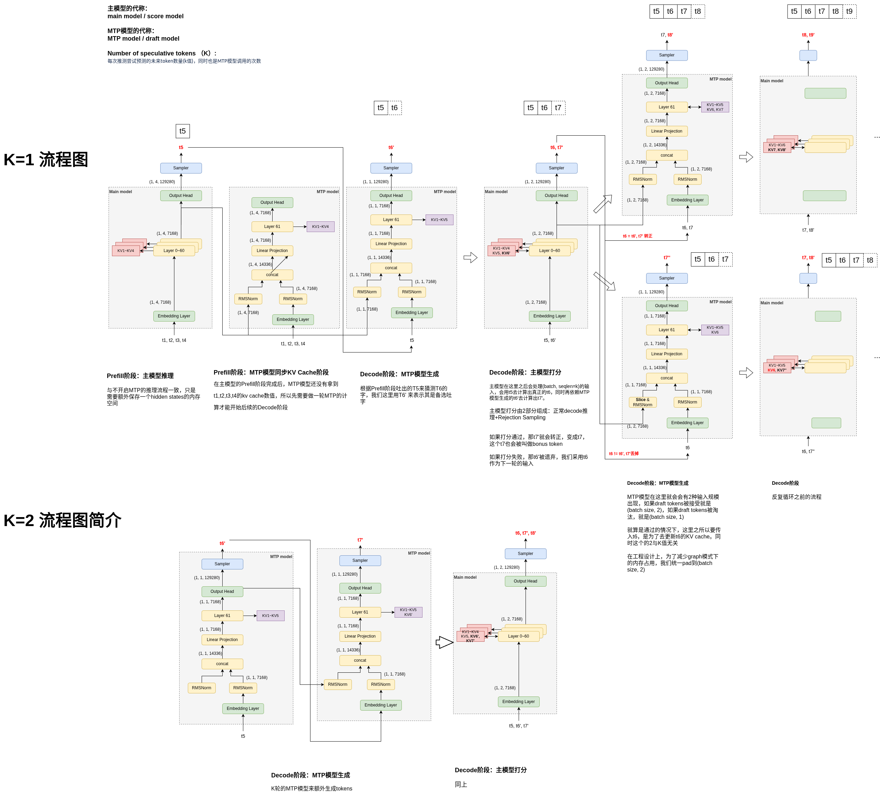
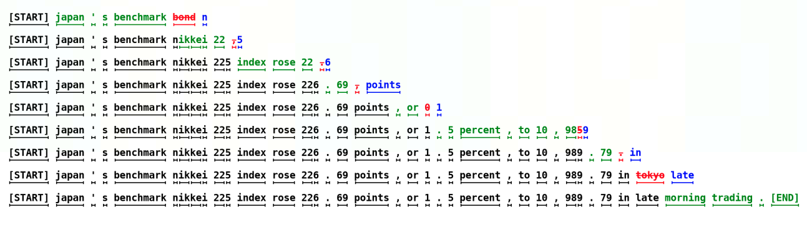
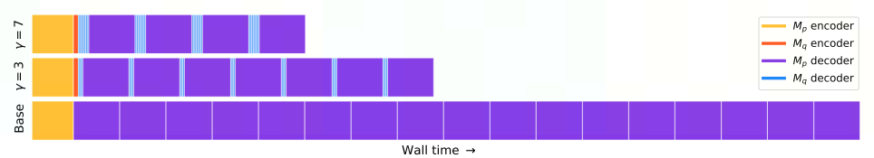

# Inference

## Inference Process

- **LLM Decoder 大模型解码器的推理步骤**
    - LLM 解码器的推理主要分为两步, 黄色为 prompt, 蓝色为每个 token generation.
        - prompt.
        - LLM 生成一个完整 token 序列, 当遇到 stop token 或最大句子长度就停止.
        
    - LLM decoder 的推理是收到内存/显存限制的 (Memory Bound), 这意味着推理的吞吐能力很大程度取决于用户给到 HBM (高宽带内存, High Bandwidth Memory) 显存多大的 batch size, 而不是 GPU 算力越高, 吞吐越大. HBM 的消耗随着 model size 和句子 seqlen 而变化. 例如, 在 13B 参数的模型中, 对于 sequence 中每个 token 的 state 都要花费 1M 的空间, 对于 A100 显存为 40G 的显卡, 13B 模型的参数占了 26G, 还剩 14G 的空间可以保存 14k token 的 state, 如果我们设置 seqlen 为 512, 那么 batch size 最大是28, 如果 seqlen 为 2048, 那么 batch size 最大为 7. 这是一个理论的上限值, 因为还没算中间 tensor 的内存/显存占用.
    - 由此可见, 量化在大模型的推理中作用很大, 可以加大单卡上的 batch size 和 seqlen, 但是需要修改模型的权重 (flash attention 不用修改模型权重, 使用 continuous batching 也可以提高 memory IO 的效率).

- **LLM Decoder 大模型解码器的推理过程**
    - Load weights 加载权重
        - 内存: 模型权重. KV cache为空.

    - Tokenization 分词
        - 作用: 将用户输入的原始文本(prompt)转换为模型可理解的token ID序列.
        - 执行: 在推理开始之前执行.
        - 位置: 通常在CPU上执行(除非使用某些triton GPU加速的tokenizer).
        - 输出: 一个整数列表(token IDs), 长度为$L$.
        - 内存: 内存几乎无变化, 只储存token IDs, 占内存很小.

    - Prefill 预填充
        - 作用: 将整个prompt的token序列一次性输入模型, 计算所有 token 的 KV Cache, 为后续自回归生成做准备.
        - 执行方式: 并行处理整个prompt(token), (因为所有 token 已知), 一次性前向传播(forward pass).
        - 输出: 最后一个token的logits(用于采样第一个生成 token), 以及完整的 KV Cache.
        - 内存: 计算量最大的阶段之一, 内存增长也最剧烈.
            - KV Cache 被填充:每个 transformer 层为 prompt 的每个 token 存储 key 和 value 向量.
                - 内存占用 $ \approx 2 \times L \times d_{model} \times n_{layers} \times bytes\_per\_param$
                - 例如:L=1000, d=4096, layers=32, float16, 占用内存约500MB.
            - 激活值 (activations):在前向过程中临时存在，但通常不保留(除非需要梯度).
            - 峰值内存: Prefill 阶段通常达到推理过程中的内存峰值，因为要同时处理长序列且构建完整 KV Cache.
        - chunked prefill
            - 背景: 当prompt非常长(例如大于32k tokens)时, 一次性prefill可能会导致超出GPU显存(KV cache太大), 或者显存碎片等.
            - 解决方案: 将prompt分成多个chunks(块), 逐块处理. 每个块做一次partial prefill, 累积KV cache, 当最后一块处理完之后, 再进行decode.

    - Decoding 自回归生成
        - 作用: 逐个生成新 token, 每次只处理一个 token(自回归).
        -  执行: 每次使用上一步生成的 token 作为输入, 利用已缓存的 KV Cache(避免重复计算历史 token 的 attention).执行一次 decode forward(也叫 generation forward). 循环执行，直到遇到 EOS(end-of-sequence)或达到最大长度.
        - 输出: 循环输出token.
        - 内存: 这里讨论每步的内存. decode阶段内存增长缓慢, 但总内存持续上升.
            - 每次只增加一个token的KV cache.
            - 内存线性增长: 每生成一个token, KV cache增长约为 $2 \times d_{model} \times n_{layers}$.
            - 激活值: 很小, 每次只处理一个token.

    - Sampling 采样
        - 作用: 根据 decode forward 输出的 logits，选择下一个 token.
        - 策略: 可以是 greedy(取最大 logit)、top-k、top-p(nucleus)、temperature scaling 等.
        - 执行: 每次 decode forward 之后.
        - 输出: 一个 token ID，作为下一轮 decode 的输入.

    

- **自回归采样**
    - 大模型的自回归采样过程如下:
        - 1 模型使用prompt(prefill结果)作为输入, 将输出结果处理和归一化成为概率分布后, 采样生成下一个token.
        - 2 将生成的token和prefill结果拼接成为新的输入, 重复执行步骤1, 直到生成eos或者达到最大token数目.
        - 在第1步中, 将模型输出的logits转换成概率, 有几种常用的采样方法, 包括argmax, top-k和top-n

## vLLM

- **vLLM definition**
    - vLLM是一个大模型推理服务框架, 目前做到: 最牛的serving吞吐量, Paged Attention 对 kv cache的有效管理, 传入请求的 continus batching 而不是 static batching, 高性能 CUDA kernel, 流行的 HuggingFace 模型无缝集成, 有各种 decoder 算法的高吞吐量服务, 包括 parallel sampling 和 beam search 等, tensor parallel, 兼容 OpenAI 的 API 服务器.

- **LLM Batching**
    - LLM Batching
        - LLM Batching 的推理具有"迭代"的性质, 因为某些客户端的请求可以在 batching 中很早就完成, 但释放资源之后, 并且向可能处于不同完成状态的 batch 中添加新的客户端请求非常麻烦. 因此 GPU 资源没有充分利用, 因为一个 batch 中不同的 seqlen 的生成长度不同于 batch 的最大生成长度, 比如下图中, seq1 生成了 2 个 token, seq3 生成了 1 个, seq4 生成了 2 个, 然而 seq2 生成了 5个, seq1 seq3 seq4结束标记后的白色方块就是 GPU 空闲, 此时 GPU 利用率很低, 传统的 static batching 无法利用 GPU 的空闲时间.
        
        - static batching 在 GPU 上的利用率取决于一个 batch 中这些句子的生成长度. 在分类任务中每个 seq 的输出长度为 1, 在聊天任务中每个 seq 的输出长度不确定, 会降低 GPU 的利用率.

    - Continus Batching
        - 每当一个 batch 中的一个 seq 生成结束, 产生一个 end-of-seq token, 就可以在其位置插入新的 seq 继续生成 token, 从而达到比 static batching 更高的 GPU 利用率.
        

- **Paged Attention**
    - Paged Attention 是对 kv cache 所占空间的分页管理, 是一个典型的以内存空间换计算开销的手段, vllm 和 tenorRT-llm 都应用了这个手段来节约 kv cache 占用的 memory, 和现今大模型训练的 recompute 中间 activation 用于带宽的以计算开销换内存空间的手段恰好相反.

    - KV cache
        - 在大模型推理过程中, 所有输入到大模型中的 token 会产生注意力 key 和 value 的 tensor, 这些 tensor 保存在 GPU 的显存里, 用来生成下一个 token, 这些缓存下来的 key 和 value 的 tensor 被称为 KV cache.
            - KV cache 内存占用大, 以 Llama-13B 为例, 缓存单个序列最多需要 1.7GB 内存.
            - 动态不可预测: KV cache 的大小取决于序列的长度, 高度可变且不可预测. 由于碎片化和过度保留, 现有系统浪费了 60%-80%的内存/显存空间.
        - Paged Attention 是对 KV cache 所占空间的分页管理, 是一个典型的以内存空间换取计算开销的手段, vllm 和 tensorRT-llm 都应用了这个手段来节约 KV cache 占用的内存/显存. 目前大模型训练的 re-compute 中的 activation 用于 bwd 的以计算开销换内存的手段是相反的.

        - 大模型的核心是自回归 Transformer, 基于输入 prompt 和其之前输出的 token 序列生成词句 (token), 每次生成一个 token. 这种按照序列的生成过程会让工作负载收到内存/显存的限制, 最终限制服务的吞吐量.
        - 通过 batch 可以同时处理多个请求, 提高模型服务的吞吐量. 但是要在单一批次中处理多个请求, 就需要高效管理每个请求所占用的内存/显存空间. 下图展示了一个 (13B)130亿 参数的大模型在一台 40GB 显存的 Nvidia A100 GPU 上的内存分布.
        
        - 其中 65% 的显存分配给了模型权重, 而模型权重在提供服务期间是不会变化的. 30% 的内存用于存储请求的动态状态, 对 transformer 而言, 这些状态由与注意力机制关联的 key 和 value 的张量组成, 即 KV cache, 表示用于生成序列中新输出的 token 之前 token 上下文.
        - 其余占比较小主要包括激活, 临时张量等数据.

        - 由于模型权重是不变的, 激活等其他数据占比也很小, 因此对于 KV cache 的管理方式就成为推理时 batch size 的关键.
        - 在论文 "Efficient Memory Management for Large Language Model Serving with PagedAttention" 中, 在当前的大模型中, 一般会将球轻到的 KV cache保存在邻接的内存空间中, 因为大多数深度学习框架都需要将张量存储在相邻连续的内存中. 不同于传统深度学习工作负载中的张量, 大模型中的 KV cache 有自己独特的性质, KV cache 会在模型生成新的 token 的过程中随着时间动态地增大或减小, 而且它持续的时间和长度事先无法预估.
        - https://arxiv.org/pdf/2309.06180
        

    - vllm 架构
        - vLLM 采用集中式调度器 (scheduler) 来协调分布式 GPU 工作器 (worker) 的执行. KV cache 管理由 Paged Attention 驱动, 能够以分页的方式有效管理 KV cache.
        

    - Paged Attention 解决内存瓶颈
        - Paged Attention 为了解决 KV cache, 借鉴了操作系统中虚拟内存和分页经典思想. 与传统的注意力算法不同, Paged Attention 允许在非连续的内存空间中储存连续的 key 和 value, Paged Attention 将每个序列的 KV cache 缓存划分为块, 每个块包含固定数量的 token 的 key 和 value, 在计算注意力期间, Paged Attention内核会识别并获取到这些块. Paged Attention支持将连续的key和value存储在非相邻连续的内存空间中.
        - Paged Attention会将每个序列的KV cache分成KV块, 每个块都包含了固定数量token的key和value的向量; 这个固定数量记为KV块大小(B), 第j个KV块的key是$K
        K_j$, value是$V_j$, 注意力计算可以转换为对以下形式的对块的计算:
            $$
            A_{ij} = \frac{\exp\left(q_i^\top K_j / \sqrt{d}\right)}{\sum_{l=1}^{\lfloor i/B \rfloor} \exp\left(q_l^\top K_1 / \sqrt{d}\right)}, \quad o_i = \sum_{j=1}^{\lfloor i/B \rfloor} V_j A_{ij}^\top
            $$
        其中$A_{i,j}$是在j个KV块三注意力分数的行向量.
        - 在注意力计算期间, Paged Attention核会分开识别并获取不同的KV块.
        
        - 如图, Paged Attention的key和value向量分布在三个块上, 这三个块在物理内存上并不相连. 这个Paged Attention核都会将查询token(forth)的查询向量$q_i$与一个块(比如0块中的 Four score and seven 的键向量)中键向量$K_j$相乘, 以计算注意力分数$A_{i,j}$, 然后再将$A_{i,j}$与块中的值向量$V_j$相乘, 得到最终的注意力输出$o_i$.
    
    - KV cache 管理
        - 使用Paged Attention, 将KV cache重新排列组合成固定大小的 KV 块, 就像虚拟内存中的分页. KV cache被划分成块, 块不需要在内存空间中连续.
        - 对KV cache的请求会被表示成一系列逻辑 KV 块, 在生成新token和它们的KV cache时从左向右填充. 最后一个KV块中未填充的位置留给未来填充.
        - 因为块在内存中不需要连续, 因此可以用一种更加灵活的方式管理key和value. 就像在操作系统的虚拟内存中一样, 可以将块视为页面, 将token视为字节, 将序列视为进程. 序列的连续逻辑块通过块表映射到非连续物理块中, 物理块在生成新token时按需分配.
        - 在Paged Attention中, 内存浪费只会发生在序列的最后一个块中. Paged Attention还有另一个优势, 即高效的内存共享, 在并行采样中多个输出序列是由同一个提示(prompt)生成的. 在这种情况下, 提示的计算和内存可以在输出序列中共享.
    
    - Paged Attention Example
        - vllm在对单个输入序列的解码过程中执行Paged Attention和管理内存.
        
        - 从全局来看, 在每次解码迭代中, vLLM首先会选取一组候选序列来批处理, 并为新请求的逻辑块分配物理块. 然后, vLLM会将当前迭代的所有输入token连接起来, 组成一个序列并将其输入到大模型. 在计算过程中, vLLM使用Paged Attention核来访问以逻辑KV块形式存储的之前的KV cache, 然后将新生成的KV cache保存到物理KV块中.

        - 在一个 KV块中存储多个token(块大小 > 1)可让Paged Attention核并行处理多个位置的KV cache, 由此可以提升硬件使用率并降低延迟.
        

    - vLLM code
        ```python
        from vllm import LLM, SamplingParams

        # Sample prompts.
        prompts = [
            "Hello, my name is",
            "The president of the United States is",
            "The capital of France is",
            "The future of AI is",
        ]
        # Create a sampling params object.
        sampling_params = SamplingParams(temperature=0.8, top_p=0.95)

        # Create an LLM.
        llm = LLM(model="facebook/opt-125m")
        # Generate texts from the prompts. The output is a list of RequestOutput objects
        # that contain the prompt, generated text, and other information.
        outputs = llm.generate(prompts, sampling_params)
        # Print the outputs.
        for output in outputs:
            prompt = output.prompt
            generated_text = output.outputs[0].text
            print(f"Prompt: {prompt!r}, Generated text: {generated_text!r}")
        ```


## Inference

- **大模型推理时的参数设置**
    - Temperature: 用于调整随机从生成模型中抽样的程度, 使得相同的提示可能会产生不同的输出. 温度为0将始终产生相同的输出, 该参数设置越高随机性越大.
    - 波束搜索宽度(Beam Search Width): 波束搜索是许多NLP和语音识别模型中常用的一种算法, 作为在给定可能选项的情况下选择最佳输出的最终决策步骤. 波束搜索宽度是一个参数, 用于确定算法在搜索的每个步骤中应该考虑的候选数量.
    - Top p: 动态设置tokens候选列表的大小. 将可能性之和不超过特定值的top tokens列入候选名单. Top p通常设置为较高的值(如 0.75), 目的是限制可能被采样的低概率token的长度.
    - Top k: 允许其他高分tokens有机会被选中. 这种采样引入的随机性有助于在很多情况下生成的质量. Top k参数设置为3则意味着选择前三个tokens. 若Top k和Top p都启用, 则Top p在Top k之后起作用.


- **大模型推理的过程** to be continue
    - 目前常见的大模型只包括了Transformer Decoder, 每个token在输入模型到Transformer Decoder之前, 都会先从Word Embedding层中通过查表获取对应的Embedding向量, 然后将Embedding向量输入到Transformer Decoder中, 并且在最后一层输出的也是相同维度的Embedding. 在预测下一个Token时, 实际上只利用了上一个Token的Embedding.
    - 如图所示, 输入是"a robot must obey the orders given it", 将其转换成对应的Embedding后, 输入到Transformer Decoder中, 每一个token对应的位置相应的也会生成一个新的embedding, 使用最后一个token "it"对应新生成的embeddeding(蓝色)来生成的新的token "Okay", 之后再把刚刚生成的这个token "Okay" 也作为输入, 根据 "Okay" 产生的embedding继续生成的新的token "human", 以此类推.
    
    - 根据新生成的embedding生成下一个token的过程如下图所示, 让新生成的embedding与已经缓存的token embeddings矩阵相乘(也就是, 新生成的token与每个token对应的embedding向量做内积), 得到和词表中每个token的相似性得分(logits), 然后基于这个得分即可以选择生成新的token(常用做法就是直接取得分最高的token).
    
    - 其中, token embeddings的行数即位模型词表中token的个数, 列数即位embedding的维度, 也就是每个token对应一个ebedding维度的向量.
    


- **eager和graph模式**
    - graph模式
        - 首先介绍一下vLLM默认使用的CUDA Graph(即graph模式)
        - CUDA Graph 是 NVIDIA 提供的一种机制, 可以将一系列CUDA操作"录制"成一个静态图, 然后反复高效重放. 在LLM推理中, decode的步骤, 即每次生成一个token的计算模式高度重复, 特别是在相同的batch size, 相同的sequence length增量情况下, 非常适合用CUDA Graph加速.
        - vLLM 会为不同batch size和sequence length组合预录制多个 CUDA Graph, 在推理时动态匹配并重放, 可以减少CPU调度开销, 避免kernel launch延迟, 提高GPU利用率, 最终降低per-token延迟.
        - 优点: 高吞吐, 低延迟(尤其在稳定batch下)
        - 缺点: 需要"静态"执行模式, batch size, sequence length等必须提前知道或匹配已有graph. 内存占用会偏高.

    - eager模式
        - 启用enforce-eager(在vLLM启动时加--enforce-eager)会强制禁用CUDA Graph, 所有前向计算都以"即时执行"(eager execution)方式进行. 即每次forward都直接调用PyTorch或底层kernel计算, 不做图录制或重放.

    - 其他框架中使用
        - PyTorch: 默认就是 eager 模式. torch.compile()是图模式.
        - TensorRT-LLM: 使用 engine 编译, 本质也是静态图, 不支持真正意义上的 eager.
        - HuggingFace Transformers + accelerate: 纯 eager, 无 graph 优化(所以比 vLLM 慢).


- **Greedy Search**
    - 假设词表中有"a", "given", "human", "it", "must", "obey", "Okay", "orders", "robot", "the", ".", "EOS" 共12个token, 其中"EOS"表示终止token. Greedy Search

- **all2all**
    - 在以vllm为代表的大模型推理框架中, all2all是一个关键的通信操作, 尤其在MoE模型的Expert parallel场景中起到了核心作用.
    - all2all的概念
        - all2all是一种多GPU或多节点之间的数据交换模式, 其中每个GPU向其他的GPU发送数据, 并从所有其他的GPU接收数据, 与AllReduce/AllGather/BroadCast并列, 是分布式训练和推理中常见的集体通信操作.
    - all2all的意义
        - 在MoE模型里, 每个token被路由(routing)到特定的专家(expert)上进行计算, 不同的token会被分配到不同的专家, 为了实现高效的并行, 不同的专家会被分配到不同的GPU上, 即为expert parallel.
        - 在expert parallel的背景下, 当前GPU上的token可能需要到其他的GPU上进行计算, 计算完成后将结果传回, 这样的过程是由all2all实现的.
    - all2all的过程
        - 假设有8个GPU, 8个专家, 每个GPU负责一个专家.
        - Inputs
            token, 分布在各个GPU上.
        - Routing
            通过gating, 决定每个token分配到哪个专家.
        - all2all发送
            每个GPU把自己负责的token按照目标专家(目标GPU)进行分组, 然后发送给对应的GPU.
        - 本地计算
            每个GPU只计算分配给它的token
        - all2all接收
            计算完成后, 结果通过all2all传回原来的GPU
    - 通信开销
        通信量计算 $All communication \approx seq\_len \times hidden\_size \times (num\_experts / num\_device) \times comm\_round $
    
- **MoE权重的结构**
    - 在MoE模型中, gate_proj, up_proj和down_proj共同够成了专家网络(Expert Network)和路由机制(Gating Mechanism).
    - MoE的基本结构
        - 一个典型的MoE层包含
            ```python
            输入 x
            │
            ▼
            [Gate] -> 路由 (决定x的哪些部分去哪个expert)
            │
            ▼
            Experts: [Expert_0, Expert_1, ..., Expert_N]
            │ (每个expert是一个FFN子网络)
            ▼
            加权组合输出
            │
            ▼
            输出 y
            ```
        - 每个expert通常是一个FFN, 其结构类似:
            ```python
            x -> [Up Projection] -> [Activation] -> [Down Projection] -> output
            ```
        - Gate负责输入应该走哪个或者哪些专家.
    
    - Gate 门控函数/路由
        - 决定了每个token应该被路由到哪一个或哪几个专家.
        - 输入: $x \in R^d$, gate网络通常是一个线性层:
            - $ g(x) = \text{softmax}(W_g x) \quad \text{or} \quad {top_k} {\text{softmax}(W_g x)} $
        - 输出: 一个概率分布(权重), 表示每个专家被选中的概率大小.
        - Gate不改变数据流, 只做决策. 参数量通常很小, 只是一个$d \rightarrow N$的线性层, $N$是专家数.

    - Up projection 上投影
        - 将输入从隐藏维度d映射到更高维的中间表示空间(这个中间表示空间是expert内部FFN的扩展层).
        - 输入: hidden layer size, $d_{model}$
            - $ h = up\_{proj}(x) = W_{up} $
            - 其中 $W_{up} \in R^{d_{ff} \times d}$, $d_{ff}$是FFN的中间维度. 
        - 输出: intermediate size, "intermediate_size"
        - Example, Mixtral-8x7B
            - In config.json:
                ```java
                hidden_size: 4096
                intermediate_size: 14336
                ```
            - Input: [seq_len, 4096]
            - Output: [seq_len, 14336]
        - 标准transformer中FFN的第一个线性层(有时也叫fc1).
        - 维度通常被“向上”扩展, 增加模型容量, 因此被称为"up".

    - Down projection 下投影
        - 将中间表示空间的高维表示$h$投影回原始隐藏维度$d$, 以便与残差连接兼容.
        - 输入: 
            - $ y = {down_{proj}}(h) = W_{down} h $
            - 其中, $ W_{down} \in R^{d \times d_{ff}} $
        - 输出:
        - 这是标准FFN的第二个线性层(有时也叫fc2).
        维度通常从高维"向下"压缩回到原始维度, 因此被称为"down".
    
    - 中间激活函数
        - 通常在up_proj之后会有一个非线性的激活函数, 比如:
            - $ SwiGLU = SwiGLU(a, b) = Swish(a) \times b $, 其中
                - $a = W_{gate} x
                - b = W_{up} x$
                - 所以实际上有两个"up_proj"分支.
        - 在SWiGLU架构中
            - gate_proj: generate gate branch
            - up_proj: generate "up" branch
            - down_proj: final output
        - Example, Mixtral structure uses MLP with SwiGLU:
            ```python
            class MoEFeedForward(nn.Module):
                def forward(x):
                    g = gate_proj(x) # [d] -> [d_ff]
                    u = up_proj(x) # [d] -> [d_ff]
                    h = swish(g) * u # element wise
                    out = down_proj(h) # [d_ff] -> [d]
                    return out
            ```

- **chunked prefill**
    - 当prompt非常长(128k)时, 由于产生的KV cache太大, 一次性Prefill可能超出GPU显存, 从而导致显存碎片或OOM. 因此, 可以将prompt分成多个chunk(块), 逐块处理.
    - 每块做一次partial prefill, 累积 KV Cache, 当最后一块处理完后, 再开始 decode.

- **MTP**
    - MTP(Multi-Token Prediction)是一种旨在提升大模型推理吞吐(throughput)的优化技术, 其核心思想是: 在单次前向传播中预测多个未来token, 而非传统自回归方式的每次一个token.
    - reference
        https://www.youtube.com/watch?v=oXRSorx-Llg
        https://zhuanlan.zhihu.com/p/29082207943
        https://github.com/vllm-project/vllm/pull/12915
        https://github.com/sgl-project/sglang/pull/3582
        https://github.com/vllm-project/vllm/pull/12755
        https://github.com/vllm-project/vllm/pull/13269
        https://github.com/vllm-project/vllm/pull/13578
        https://github.com/vllm-project/vllm/pull/13626
        Accelerating Large Language Model Decoding with Speculative Sampling: https://arxiv.org/pdf/2302.01318
        deepseekv3 paper: https://github.com/deepseek-ai/DeepSeek-V3/blob/main/DeepSeek_V3.pdf
        https://zhuanlan.zhihu.com/p/15037286337
        https://zhuanlan.zhihu.com/p/651359908
        https://zhuanlan.zhihu.com/p/658298728

    - MTP的原理
        - 问题: 传统的自回归模型GPU利用率低(尤其在是小batch_size或者短prompt的情况下), 内存带宽未饱和, 延迟主导场景下的吞吐性能差.
        - 目标: 在保证生成质量的前提下, 通过一次生成多个token, 减少前向计算次数, 提升吞吐.
        

        - 传统的自回归解码(Autoregressive Decoding)每次前向传播生成1个token, 存在计算效率瓶颈.
            - 在传统的自回归解码中, 初始prompt的token是"how", "how"先经过embedding计算变成$e_{how}$, 然后经过Decoder Layer的计算, 输出特征向量$f_{how}$ (最后一层hidden states), 经过LM Head转换成一个概率分布向量$p_{how}$, 通过采样得到生成结果token "can".
            - 然后LLM会把"can"作为新的输入, 进行下一步的计算, 直到LLM给出推理结束的token "\<EOS\>".
            - 自回归解码是逐token迭代进行的, 生成一个token, 将token作为输入生成新的token, 直到遇到结束条件"\<EOS\>"或者到达了最大的生成长度.
        - 在投机解码(Speculative Decoding)里
            - 在投机解码中, 初始的prompt的token还是"how", embedding不变, 在Decoder Layer时会通过其他方式(比如一个小模型, draft model)先推测两个草稿token(draft token) "can" "we", 同时输入到目标模型. 普通的Decoder实现仅能解码得到一个token, 这里改造成了能够同时解码输出3个token的hidden states. 这样就可以同时得到$p_{how}$, $p_{can}$和$p_{we}$, 然后可以根据draft model输出的$q_{how}$和$p_{can}$进行比较, 验证是否接受draft model的draft token "can"和"we".
            - 在上面的例子里, 目标模型的验证结果是接受"can", 但是拒绝"we", 所以就使用$p_{can}$进行采样, 得到了生成结果token "I". 这就意味着, 投机解码通过一次推理, 得到了两个token "can"和"I", 实现了一倍逻辑加速.
        - 投机采样(speculative decoding)是一种可以从根本上解码计算访存比的方法, 保证和使用原始模型的采样分布完全相同. 它使用两个模型: 一个是原始目标模型, 另一个是比原始模型小得多的近似模型. 近似模型用于进行自回归串行采样, 而大型模型则用于评估采样结果. 解码过程中, 某些token的解码相对容易, 某些token的解码则很困难. 因此, 简单的token生成可以交给小型模型处理, 而困难的token则交给大型模型处理. 这里的小型模型可以采用与原始模型相同的结构, 但参数更少, 或者干脆使用n-gram模型. 小型模型不仅计算量较小, 更重要的是减少了内存访问的需求.
        - 下图中每一行代表一次迭代. 绿色的标记是由近似模型提出的token建议, 而目标模型判断是否接受了这些token生成的建议. 红色和蓝色的标记分别表示被拒绝和其修正.
        - 在第一行中, 近似模型生成了5个token, 目标模型使用这5个token和前缀拼接后的句子”[START] japan’s bechmark bond”作为输入, 通过一次推理执行来验证小模型的生成效果. 这里, 最后一个token "bond"被目标模型拒绝, 重新采样生成"n". 这样中间的四个token, "japan" "'s" "benchmark"都是小模型生成的. 以此类推, 由于用大模型对输入序列并行地执行, 大模型只forward了9次, 就生成了37个token. 尽管总的大模型的计算量不变, 但是大模型推理一个1个token和5个token延迟类似, 这还是比大模型一个一个蹦词的速度要快很多.
        
        - 顶部一行显示了$\gamma=7$的投机采样, 中间一行显示了$\gamma=3$的投机解码，是小模型一次生成token数目(num_speculative_tokens). 可以观察到使用投机采样可以解码时间大幅缩减.
        


    - MTP的技术路线
        - 确定性MTP(N-gram/Cache-based MTP)
            - 利用已经生成的上下文匹配历史N-gram, (无需模型计算)直接猜测后续的多个token, 在错误时进行回退.
        - 模型增强MTP(Multi-token head/Parallel Prediction)
            - 修改模型结构, 或者利用其内在能力, 让最后一层或者额外的head同时输出多个future token.
        - 严格意义上的MTP并非指的是单一的标准或技术, 而是对于单次推理输出多个token这类技术的统称, 目前工业界更常用的是Speculative Decoding.
        - 在MTP中, 自回归依赖被打破, decoder真实生成时是严格依赖前序token的, 因此需要保证token并行预测时的正确性, 做法是只在高置信区域(如重复模式, 固定短语)的位置启用, 或者通过veriftication step(如target model校验)排除错误的预测.
        - 在训练和微调时, 如果新增head(Medusa), 需要额外训练auxiliary heads; 如果只利用base model(Lookhead), 需要prompt engineering或者dynamic caching.

    - vLLM中的MTP
        - vLLM原生支持Speculative Decoding(即MTP类技术), 主要是通过两个机制实现:
            - Draft model + Target Model
                - 使用一个更小更浅(层数更少)的draft model做speculative proposals.
                - target model(即原模型)负责verification.
                - MTP的模型增强路线, 但是draft model是独立的模型, 并非head扩展.
            - 相关api:
                ```python
                python -m vllm.entrypoints.openai.api_server \
                    --model meta-llama/Llama-3-8B-Instruct \
                    --speculative-model meta-llama/Llama-3-8B-Instruct \  # 或更小模型，如 TinyLlama
                    --num-speculative-tokens 5
                ```
        - 底层机制: chunked prefill + block wise KV cache
            - vLLM的Paged Attention和连续块管理(Block Manager)天然支持speculative tokens的KV cache预分配与回滚.
            - verification失败的时候, 可以快速discard speculative tokens 对应的 cache blocks.

        - 
        
    
            
